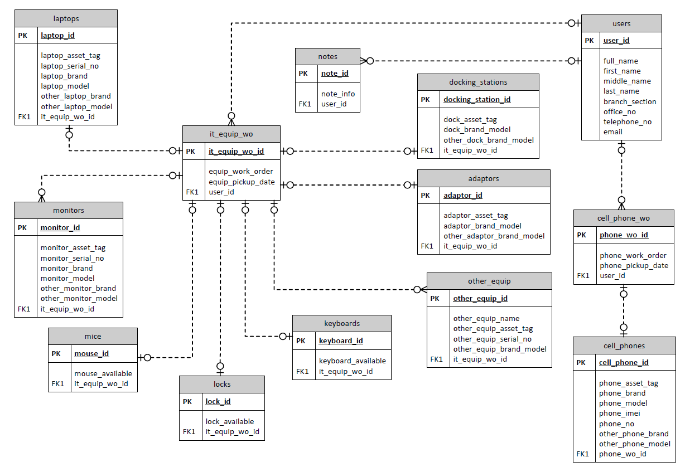

# IT Equipment Inventory 

https://github.com/acyc99/IT_Equipment_Inventory/assets/105580341/ae1fe2b3-00d4-498a-9239-834d492ad4af

## Introduction 
IT Equipment Inventory is a web application that uses the Pug HTML template and CSS for the front-end, JavaScript for the back-end, and MySQL as the database. It is designed to record and manage IT equipment. 

### Technologies Used 
* Pug HTML Template 
* Cascading Style Sheets (CSS)
* JavaScript (Express.js)
* MySQL and Sequalize 

### Entity-Relationship Diagram (ERD)


## Features 
* **Inventory Management**: Easily add IT equipment entries and avoid duplicate work orders
* **Database Storage**: Use Sequelize to insert data into MySQL database 

### Planned Improvements / Future Features 
* User Authentication 
* Display all the records 
* Search and Filter 
* Edit / Delete 
* Responsive Design 

## Getting Started
1. Clone this IT_Equipment_Inventory repository: `git clone https://github.com/acyc99/IT_Equipment_Inventory.git`
2. Install the project dependencies: `npm install`
    <!-- Node Package Manager (npm) -->
    <!-- 
    * Express: `npm install express`
    * Nodemon: `npm install nodemon`
    * Pug: `npm install pug`
    * Pug's Command Line Interface (CLI): `npm install -g pug-cli`
    * Sequelize: `npm install sequelize`
    * MySQL2: `npm install mysql2` 
    -->
3. Configure the database settings (see [Database Configuration](#database-configuration)) 
4. Start the web application: `nodemon app.js`
5. IT Equipment Inventory application is running on `http://localhost:9999/inventory-entry`

### Database Configuration
Create a **config** folder to hold the **db-config.js** file, which contains the information to establish a connection with the database. 

``` JavaScript
// Connect to Database 
module.exports = {
    HOST: 'localhost',
    USER: 'root',
    PASSWORD: '',
    DATABASE: 'it_equipment_inventory', // The database created in MySQL 
    DIALECT: 'mysql'
}
```

## Usage 
1. Open a web browser and go to http://localhost:9999/inventory-entry
2. Start entering IT equipment entries (note: there are some required fields)
3. Add IT equipment into the inventory
